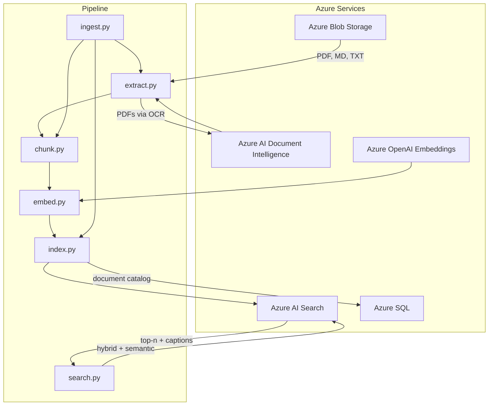

# Azure Hybrid RAG Pipeline - Documentation

## Architecture



**Flow**: Blob Storage → Document Intelligence (PDF OCR) → Text Splitter → Azure OpenAI Embeddings → Azure AI Search (with Semantic Ranking). A document catalog (SQLite in dev, Azure SQL in prod) tracks ingested documents for incremental updates.

## StateGraph (DeepEval-Driven Routing)

The `search.py` module exposes a LangGraph `StateGraph` that uses DeepEval metrics (answer relevancy, contextual relevancy) to conditionally route the RAG pipeline:

1. **Retrieve** → **Generate** → **Evaluate** (via DeepEval with Claude Haiku 4.5)
2. If evaluation **passes**, return the answer.
3. If **contextual relevancy fails** and retries remain: rephrase the query, dynamically increase `top_n`, relax `eval_threshold`, and re-retrieve.
4. If **answer relevancy fails** or retries exhausted: return differentiated feedback.

**Dynamic parameter adjustment on retry:**

| Parameter | Adjustment | Bounds |
|-----------|-----------|--------|
| `top_n` | Increases by `max(2, round(gap * 10))` where `gap = threshold - contextual_relevancy_score` | Capped at `top_n_max` (default 15) |
| `eval_threshold` | Decreases by 0.05 per retry | Floored at `eval_threshold_floor` (default 0.3) |

The original query is preserved in state and the rephrased query, final `top_n`, and final `eval_threshold` are all surfaced in the return value.

## Environment & Testing Strategy

To ensure a smooth developer experience while maintaining an enterprise-ready architecture, this pipeline implements an environment toggle (`ENVIRONMENT=dev|prod`).

**Development Mode (dev)**: Utilizes Azurite for local Azure Blob Storage emulation, standard OpenAI API for embeddings, Chroma vector store (cosine similarity), and SQLite document catalog. Local data is stored in hidden folders: `.azurite-data/` (Azurite), `.sql-data/` (document catalog), `.chroma-data/` (Chroma), and `.deepeval/` (DeepEval cache).

**Production Mode (prod)**: Fully connects to the Azure AI Foundry ecosystem, utilizing Azure Blob Storage, Azure AI Document Intelligence, Azure OpenAI, and Azure AI Search with Semantic Ranking.

The default submission is configured for **prod**. Please update the `.env` file with your Azure credentials to execute the end-to-end cloud pipeline.

## Setup

1. Create virtual environment: `python3 -m venv venv`
2. Activate: `source venv/bin/activate` (macOS/Linux)
3. Install (all versions are pinned for reproducibility): `pip install -r requirements.txt`
4. Copy `.env.example` to `.env` and populate credentials

### Azure Resources (prod)

- **Blob Storage**: Create storage account and container. Upload documents to `manuals/`, `troubleshooting/`, `policies/`.
- **Document Intelligence**: Create Azure AI Document Intelligence resource for PDF OCR.
- **OpenAI**: Create Azure OpenAI resource with embedding deployment (e.g. `text-embedding-3-small`).
- **AI Search**: Create Azure AI Search service (Basic tier or above). Semantic ranker must be enabled.
- **Azure SQL** (optional, for document catalog): Used as the metadata ledger in prod. Dev uses SQLite. To run the Azure SQL production ledger, ensure Microsoft ODBC Driver 18 is installed on your system and run `pip install pyodbc`.

### Local Testing (dev)

- **Azurite**: See [Installing Azurite](#installing-azurite) below. Uses hidden `.azurite-data/` folder. **Note:** `.azurite-data/` is created by Azurite when you start it—not by the Python code or notebook. The demo notebook uses `--local` and loads from `data/`, so Azurite is optional.
- **OpenAI API key**: Standard OpenAI key for embeddings (~$5 for testing).
- **Local data folders**: `.azurite-data/` (Azurite—created when Azurite starts), `.sql-data/` (document catalog), `.chroma-data/` (Chroma), `.deepeval/` (DeepEval cache). All are gitignored.

### Installing Azurite

Azurite is Microsoft's local Azure Storage emulator. Choose one method:

**Option 1: VS Code extension (easiest)**

1. Open VS Code (or Cursor)
2. Install the "Azurite" extension by Microsoft
3. Open Command Palette (`Cmd+Shift+P`) → run "Azurite: Start"
4. Azurite runs on `http://127.0.0.1:10000` (Blob)

**Option 2: npm (requires Node.js)**

```bash
# Install Node.js first (macOS with Homebrew)
brew install node

# Install Azurite globally
npm install -g azurite

# Start Azurite (Blob service on port 10000)
azurite --silent --location ./.azurite-data --debug ./azurite-debug.log
```

**Option 3: Docker**

```bash
docker run -p 10000:10000 -p 10001:10001 -p 10002:10002 mcr.microsoft.com/azure-storage/azurite
```

**Connection string for .env (when Azurite is running):**

```
AZURE_STORAGE_CONNECTION_STRING="DefaultEndpointsProtocol=http;AccountName=devstoreaccount1;AccountKey=Eby8vdM02xNOcqFlqUwJPLlmEtlCDXJ1OUzFT50uSRZ6IFsuFq2UVErCz4I6tq/K1SZFPTOtr/KBHBeksoGMGw==;BlobEndpoint=http://127.0.0.1:10000/devstoreaccount1;"
```

**Upload test documents to Azurite:** Use Azure Storage Explorer or the Azure CLI (`az storage blob upload-batch`) pointing at the connection string above. Create a container (e.g. `documents`) and upload files to `manuals/`, `troubleshooting/`, `policies/`. Or run `python -m src.ingest --upload` to upload local `data/` to Azurite.

## Assumptions

Per the prompt, this pipeline assumes Azure services are provisioned. The code is written natively for Azure Blob Storage, Azure AI Document Intelligence, Azure OpenAI, and Azure AI Search with Semantic Ranking enabled.

## Document Catalog (Metadata Ledger)

The pipeline maintains a document catalog that tracks ingested documents for incremental updates and delete-by-document support. In dev, the catalog uses SQLite at `.sql-data/document_catalog.db` (override with `SQL_DATA_DIR` env). In prod, it uses Azure SQL (via `AZURE_SQL_CONNECTION_STRING`).

**Catalog schema:** Each document record includes `source`, `filename`, `content_hash`, `ingested_at`, `chunk_count`, `chunk_ids`, and `access_count`. The `access_count` column is incremented whenever a document's chunks are retrieved via hybrid search (useful for analytics and popularity tracking).

**Ingest options:**
- `--local`: Load from local `data/` instead of blob.
- `--incremental`: Skip documents unchanged since last ingest (by content hash).
- `--delete-source PATH`: Remove a document from the catalog and vector store.
- `--upload`: Upload local `data/` to blob (Azurite or Azure), then exit.

**Chunk lookup:** The catalog stores `chunk_ids` (JSON array) in document order. To resolve a vector-store ID from document source and chunk number (1-based), run SQL against `.sql-data/document_catalog.db`:

```sql
SELECT source, filename, chunk_count,
       json_extract(chunk_ids, '$[' || (10 - 1) || ']') AS chunk_id
FROM document_catalog
WHERE source = 'policies/security.txt';
```

Replace `10` with your chunk number and `'policies/security.txt'` with your source. Use `(chunk_number - 1)` in the `json_extract` index since the array is 0-based.

Note: For brevity in this assignment, chunk IDs are serialized as JSON. In a true production schema, this would be normalized into a one-to-many document_chunks table to allow faster indexed lookups.

## Known Limitations

- Document Intelligence free tier limits document processing to ~2 pages; higher tiers needed for full PDFs.
- Semantic ranker requires Azure AI Search Basic tier or above.
- Chroma (dev) uses cosine similarity (1 = identical, 0 = orthogonal) for scoring. It does not support semantic captions; use prod for full hybrid + caption experience.
