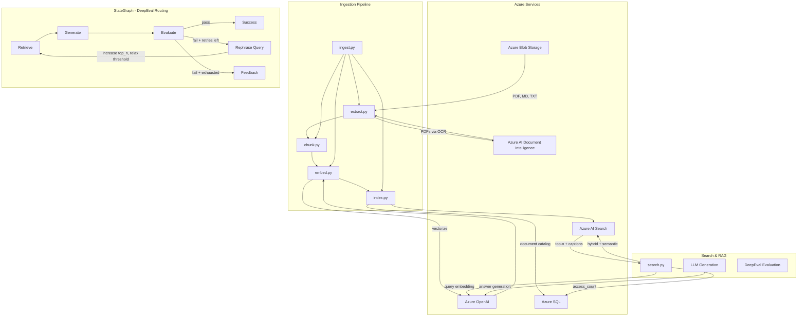

# Azure Hybrid RAG Pipeline

An Azure-native retrieval-augmented search pipeline for a knowledge base containing product manuals, troubleshooting guides, and policy documents.

## Table of Contents

- [Architecture](#architecture)
- [StateGraph (DeepEval-Driven Routing)](#stategraph-deepeval-driven-routing)
- [Environment & Testing Strategy](#environment--testing-strategy)
- [Prerequisites](#prerequisites)
- [Quick Start](#quick-start)
- [Setup](#setup)
  - [Azure Resources (prod)](#azure-resources-prod)
  - [Local Testing (dev)](#local-testing-dev)
  - [Installing Azurite](#installing-azurite)
- [Ingest Options](#ingest-options)
- [Document Catalog (Metadata Ledger)](#document-catalog-metadata-ledger)
- [Chunk Lookup (Catalog → Vector Store)](#chunk-lookup-catalog--vector-store)
- [Assumptions](#assumptions)
- [Known Limitations](#known-limitations)
  - [Evaluation & StateGraph Maturity](#evaluation--stategraph-maturity)
  - [Metadata Ledger Enrichment](#metadata-ledger-enrichment)
  - [Evaluation Cost](#evaluation-cost)

## Architecture




**Flow**: Blob Storage → Document Intelligence (PDF OCR) → Text Splitter → Azure OpenAI Embeddings → Azure AI Search (with Semantic Ranking). A document catalog (SQLite in dev, Azure SQL in prod) tracks ingested documents for incremental updates.

## StateGraph (DeepEval-Driven Routing)

The `search.py` module exposes a LangGraph `StateGraph` that uses DeepEval metrics (answer relevancy, contextual relevancy) to conditionally route the RAG pipeline:

1. **Retrieve** → **Generate** → **Evaluate** (via DeepEval with Claude Haiku 4.5)
2. If evaluation **passes**, return the answer.
3. If **either metric fails** (contextual relevancy or answer relevancy) and retries remain: rephrase the query, dynamically increase `top_n`, relax `eval_threshold`, and re-retrieve.
4. If retries are exhausted: return differentiated feedback (contextual vs. answer relevancy).

**Dynamic parameter adjustment on retry:**


| Parameter        | Adjustment                                                                                  | Bounds                                          |
| ---------------- | ------------------------------------------------------------------------------------------- | ----------------------------------------------- |
| `top_n`          | Increases by `max(2, round(gap * 10))` where `gap = threshold - contextual_relevancy_score` | Capped at `top_n_max` (default 15)              |
| `eval_threshold` | Decreases by 0.05 per retry                                                                 | Floored at `eval_threshold_floor` (default 0.3) |


The original query is preserved in state and the rephrased query, final `top_n`, and final `eval_threshold` are all surfaced in the return value.

## Environment & Testing Strategy

To ensure a smooth developer experience while maintaining an enterprise-ready architecture, this pipeline implements an environment toggle (`ENVIRONMENT=dev|prod`).

**Development Mode (dev)**: Utilizes Azurite for local Azure Blob Storage emulation, standard OpenAI API for embeddings, Chroma vector store (cosine similarity), and SQLite document catalog. Local data is stored in hidden folders: `.azurite-data/` (created when Azurite starts), `.sql-data/` (document catalog), `.chroma-data/` (Chroma), and `.deepeval/` (DeepEval cache). The demo notebook uses `--local` and loads from `data/`—no Azurite required.

**Production Mode (prod)**: Fully connects to the Azure AI Foundry ecosystem, utilizing Azure Blob Storage, Azure AI Document Intelligence, Azure OpenAI, Azure AI Search with Semantic Ranking, and Azure SQL.

The default submission is configured for **dev**. Please update the `.env` file with your Azure credentials to execute the end-to-end cloud pipeline on **prod**.

## Prerequisites

- Python 3.9+
- Azure subscription (for prod): Blob Storage, Document Intelligence, OpenAI, AI Search
- For dev: Azurite (optional), OpenAI API key, Anthropic API key

To run the Azure SQL production ledger, ensure Microsoft ODBC Driver 18 is installed on your system and run `pip install pyodbc`.

## Quick Start

1. **Create virtual environment**

```bash
python3 -m venv venv
source venv/bin/activate  # On Windows: venv\Scripts\activate
```

1. **Install dependencies** (all versions are pinned for reproducibility)

```bash
pip install -r requirements.txt
```

1. **Configure environment**

```bash
cp .env.example .env
# Edit .env with your Azure credentials (for prod) or dev settings
```

1. **Run ingestion**

```bash
python -m src.ingest --local
```

> To ingest from Blob Storage instead of local files, Azurite (or Azure Blob in prod) must be running first — see [Installing Azurite](#installing-azurite). Then upload and ingest:
>
> ```bash
> python -m src.ingest --upload   # upload data/ to blob
> python -m src.ingest            # ingest from blob
> ```

1. **Query RAG with DeepEval** (or use [notebooks/demo.ipynb](../notebooks/demo.ipynb); requires `ANTHROPIC_API_KEY` for Claude Haiku 4.5)

```bash
python -m src.search "How to troubleshoot a RAG pipeline?"
# With StateGraph (dynamic retry on contextual failure):
python -m src.search "How to troubleshoot a RAG pipeline?" --use-graph
```

## Setup

### Azure Resources (prod)

- **Blob Storage**: Create storage account and container. Upload documents to `manuals/`, `troubleshooting/`, `policies/`.
- **Document Intelligence**: Create Azure AI Document Intelligence resource for PDF OCR.
- **OpenAI**: Create Azure OpenAI resource with embedding deployment (e.g. `text-embedding-3-small`).
- **AI Search**: Create Azure AI Search service (Basic tier or above). Semantic ranker must be enabled.
- **Azure SQL** (optional, for document catalog): Used as the metadata ledger in prod. Dev uses SQLite. To run the Azure SQL production ledger, ensure Microsoft ODBC Driver 18 is installed on your system and run `pip install pyodbc`.

### Local Testing (dev)

- **Azurite**: See [Installing Azurite](https://github.com/MicrosoftDocs/azure-docs/blob/main/articles/storage/common/storage-install-azurite.md) below. Uses hidden `.azurite-data/` folder. **Note:** `.azurite-data/` is created by Azurite when you start it—not by the Python code or notebook. The demo notebook uses `--local` and loads from `data/`, so Azurite is optional.
- **OpenAI API key**: Standard OpenAI key for embeddings (~$5 for testing).
- **Local data folders**: `.azurite-data/` (Azurite—created when Azurite starts), `.sql-data/` (document catalog), `.chroma-data/` (Chroma), `.deepeval/` (DeepEval cache). All are gitignored.

### Installing Azurite

Azurite is Microsoft's local Azure Storage emulator. Choose one method:

**Option 1: VS Code extension (easiest)**

1. Open VS Code (or Cursor)
2. Install the "Azurite" extension by Microsoft
3. Open Command Palette (`Cmd+Shift+P`) → run "Azurite: Start"
4. Azurite runs on `http://127.0.0.1:10000` (Blob)

**Option 2: npm (requires Node.js)**

```bash
# Install Node.js first (macOS with Homebrew)
brew install node

# Install Azurite globally
npm install -g azurite

# Start Azurite (Blob service on port 10000)
azurite --silent --location ./.azurite-data --debug ./azurite-debug.log
```

**Option 3: Docker**

```bash
docker run -p 10000:10000 -p 10001:10001 -p 10002:10002 mcr.microsoft.com/azure-storage/azurite
```

**Connection string for .env (when Azurite is running):**

```
AZURE_STORAGE_CONNECTION_STRING="DefaultEndpointsProtocol=http;AccountName=devstoreaccount1;AccountKey=Eby8vdM02xNOcqFlqUwJPLlmEtlCDXJ1OUzFT50uSRZ6IFsuFq2UVErCz4I6tq/K1SZFPTOtr/KBHBeksoGMGw==;BlobEndpoint=http://127.0.0.1:10000/devstoreaccount1;"
```

**Upload test documents to Azurite:** Use Azure Storage Explorer or the Azure CLI (`az storage blob upload-batch`) pointing at the connection string above. Create a container (e.g. `documents`) and upload files to `manuals/`, `troubleshooting/`, `policies/`. Or run `python -m src.ingest --upload` to upload local `data/` to Azurite.

## Ingest Options


| Option                 | Description                                                  |
| ---------------------- | ------------------------------------------------------------ |
| `--local`              | Load from local `data/` instead of blob                      |
| `--incremental`        | Skip documents unchanged since last ingest (by content hash) |
| `--delete-source PATH` | Remove a document from the catalog and vector store          |
| `--upload`             | Upload local `data/` to blob (Azurite or Azure), then exit   |


**Examples:**

```bash
# Re-ingest only changed documents (skips unchanged by content hash)
python -m src.ingest --local --incremental

# Delete a specific document and its chunks from the vector store
python -m src.ingest --delete-source "policies/RAG Security.txt"

# Upload local data/ to Azurite, then ingest from blob
python -m src.ingest --upload
python -m src.ingest
```

The `--delete-source` PATH must match the document's `source` value in the catalog (the relative path as ingested, e.g. `manuals/product_manual.pdf`, `troubleshooting/network.md`).

## Document Catalog (Metadata Ledger)

The pipeline maintains a document catalog that tracks ingested documents for incremental updates and delete-by-document support. In dev, the catalog uses SQLite at `.sql-data/document_catalog.db` (override with `SQL_DATA_DIR` env). In prod, it uses Azure SQL (via `AZURE_SQL_CONNECTION_STRING`).

**Catalog schema:** Each document record includes `source`, `filename`, `content_hash`, `ingested_at`, `chunk_count`, `chunk_ids`, and `access_count`. The `access_count` column is incremented whenever a document's chunks are retrieved via hybrid search (useful for analytics and popularity tracking).

## Chunk Lookup (Catalog → Vector Store)

The document catalog maps each document to its chunk IDs in the vector store. To look up the vector-store ID for a specific chunk by document source and chunk number (1-based), run SQL against `.sql-data/document_catalog.db`:

```sql
SELECT
    source,
    filename,
    chunk_count,
    json_extract(chunk_ids, '$[' || (10 - 1) || ']') AS chunk_id
FROM document_catalog
WHERE source = 'policies/security.txt';
```

Replace `10` with your chunk number and `'policies/security.txt'` with your document source. The `chunk_ids` column is a JSON array; `json_extract(..., '$[N]')` uses 0-based indexing, so use `(chunk_number - 1)`.

Note: For brevity in this assignment, chunk IDs are serialized as JSON. In a true production schema, this would be normalized into a one-to-many `document_chunks` table to allow faster indexed lookups.

## Assumptions

Per the prompt, this pipeline assumes Azure services are provisioned. The code is written natively for Azure Blob Storage, Azure AI Document Intelligence, Azure OpenAI, and Azure AI Search with Semantic Ranking enabled.

## Known Limitations

- **Document Intelligence free tier** limits document processing to ~2 pages; higher tiers needed for full PDFs.
- **Semantic ranker** requires Azure AI Search Basic tier or above.
- **Chroma (dev)** uses cosine similarity (1 = identical, 0 = orthogonal) for scoring. It does not support semantic captions; use prod for full hybrid + caption experience.

### Evaluation & StateGraph Maturity

The current DeepEval integration and StateGraph routing use a straightforward approach: after each query, two metrics—Answer Relevancy and Contextual Relevancy—are scored by a judge LLM (Claude Haiku 4.5), and the graph routes based on a single pass/fail threshold comparison. On failure, the retry logic is limited to rephrasing the query via a generic prompt, bumping `top_n`, and relaxing the threshold by a fixed 0.05 step. This is functional but leaves room for improvement.

Areas for further research and engineering include:

- **Richer evaluation metrics**: Incorporating faithfulness (does the answer hallucinate beyond the context?), latency-aware scoring, or domain-specific rubrics would give a more complete picture of output quality.
- **Smarter retry strategies**: Rather than a generic rephrase prompt, the graph could analyze *which* chunks scored poorly and apply targeted query decomposition, HyDE (hypothetical document embeddings), or multi-hop retrieval.
- **Evaluation model selection**: The judge model (currently Claude Haiku 4.5) could be swapped or ensembled depending on cost, latency, and domain alignment requirements.
- **Offline evaluation harness**: A batch evaluation suite against a golden dataset would complement the current live per-query evaluation and help tune thresholds systematically.

### Metadata Ledger Enrichment

The document catalog currently tracks `source`, `filename`, `content_hash`, `ingested_at`, `chunk_count`, `chunk_ids`, and `access_count`. While sufficient for incremental ingestion and basic analytics, richer metadata per document and chunk would unlock more advanced capabilities:

- **Document-level metadata**: Author, creation date, version, department/owner, and citations referenced within the document.
- **Chunk-level metadata**: Topic classification, named entities, summary, and confidence score from the extraction step.

This additional metadata would enable filtered retrieval (e.g. "only policy documents authored by the security team"), provenance tracking, and downstream analytics. However, it requires further engineering—automated extraction of author and citation fields from unstructured documents is non-trivial and may need additional NLP pipelines or Document Intelligence custom models.

### Evaluation Cost

A standard RAG pipeline (retrieve → generate) is relatively inexpensive per query—one embedding call and one LLM generation. Adding live evaluation introduces significant additional cost: each query now requires two extra LLM judge calls (one per metric), effectively tripling the LLM spend per request. When using the StateGraph with retries, each retry cycle adds another generation call plus two more evaluation calls, compounding the cost further.

Strategies to manage evaluation cost include:

- **Sampling**: Evaluate a percentage of production queries rather than every request.
- **Cheaper judge models**: Use smaller or distilled models for evaluation where precision is less critical.
- **Caching**: Cache evaluation results for repeated or near-duplicate queries (the `.deepeval/` cache folder already provides a basic version of this).
- **Async/offline evaluation**: Decouple evaluation from the request path—log queries and answers, then evaluate in batch to avoid impacting latency and per-request cost.

